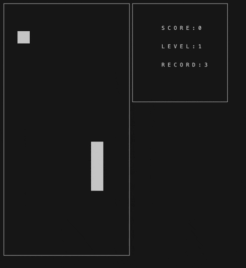

# Snake

**Терминальный интерфейс**

**Десктопный графический интерфейс**

## Резюме
В данном проекте реализована игра «Змейка» на языке программирования С++ в парадигме объектно-ориентированного программирования.

## Содержание

- [Змейка](#змейка)
  - [Содержание](#содержание)
  - [Введение](#введение)
  - [Общая информация](#общая-информация)
    - [Змейка](#змейка)
    - [Конечные автоматы](#конечные-автоматы)
    - [Паттерн MVC](#паттерн-mvc)
    - [Подсчет очков и рекорд в игре](#подсчет-очков-и-рекорд-в-игре)
    - [Механика уровней](механика-уровней)
    - [Управление](#управление)
  - [Сборка и тестирование](#сборка-и-тестирование)

## Введение

Для реализации игры «Змейка» проект состоит из: библиотеки, отвечающей за реализацию логики игры, терминального интерфейса с использованием библиотеки `ncurses` и десктопного графического интерфейса с использованием Qt.

## Общая информация
### Змейка

Игрок управляет змейкой, которая непрерывно движется вперед. Змейка должна передвигается по полю самостоятельно, на один блок вперед по истечении игрового таймера. Игрок изменяет направление движения змейки с помощью стрелок, при этом змейка может поворачивать только налево и направо относительно текущего направления движения. Цель игры заключается в сборе «яблок», появляющихся на игровом поле. При этом игрок не должен касаться стенок игрового поля. После «поедания» очередного «яблока» длина змейки увеличивается на один. Игрок побеждает, если змейка достигает максимального размера (200 «пикселей»). Если змейка сталкивается с границей игрового поля или сама с собой, то игрок проигрывает.

Начальная длина змейки равна четырем «пикселям». Игровое поле имеет размер 10 «пикселей» в ширину и 20 «пикселей» в высоту.

### Конечные автоматы

Конечный автомат (КА) в теории алгоритмов — математическая абстракция, модель дискретного устройства, имеющего один вход, один выход и в каждый момент времени находящегося в одном состоянии из множества возможных.

При работе на вход КА последовательно поступают входные воздействия, а на выходе КА формирует выходные сигналы. Переход из одного внутреннего состояния КА в другое может происходить не только от внешнего воздействия, но и самопроизвольно.

КА можно использовать для описания алгоритмов, позволяющих решать те или иные задачи, а также для моделирования практически любого процесса. 

**_Конечный автомат для данной игры:_**

.

**_Данный КА состоит из следующих состояний:_**

- **Start** — начало игры.
- **Apple Spawn** — состояние, в которое переходит игра при создании очередного яблока.
- **Shifting** — основное игровое состояние с обработкой ввода от пользователя — поворот змейки.
- **Eating** — состояние, в которое преходит игра при «соприкосновения» змейки с яблоком.
- **Loss** — проигрыш пользователя.
- **Win** — победа пользователя.

### Паттерн MVC

Паттерн MVC (Model-View-Controller, Модель-Представление-Контроллер) представляет собой схему разделения модулей приложения на три отдельных макрокомпонента: модель, содержащую в себе бизнес-логику, представление — форму пользовательского интерфейса для осуществления взаимодействия с программой и контроллер, осуществляющий модификацию модели по действию пользователя.

Модель хранит и осуществляет доступ к основным данным, производит по запросам операции, определенные бизнес-логикой программы, то есть руководит той частью программы, которая отвечает за все алгоритмы и процессы обработки информации. Данные модели, изменяясь под действием контроллера, влияют на отображение информации на представлении пользовательского интерфейса. В качестве модели в данной программе должна выступить библиотека классов, осуществляющая логику игры змейка. Эта библиотека должна предоставлять все необходимые классы и методы для осуществления механики игры. Это и есть бизнес-логика данной программы, так как предоставляет средства для решения задачи.

Контроллер — тонкий макрокомпонент, который осуществляет модификацию модели. Через него формируются запросы на изменение модели. В коде это выглядит, как некий «фасад» для модели, то есть набор методов, которые уже работают напрямую с моделью. Тонким он называется потому, что идеальный контроллер не содержит в себе никакой дополнительной логики, кроме вызова одного или нескольких методов модели. Контроллер выполняет функцию связующего элемента между интерфейсом и моделью. Это позволяет полностью инкапсулировать модель от отображения. Такое разделение полезно в силу того, что позволяет коду представления ничего не знать о коде модели и обращаться к одному лишь контроллеру, интерфейс предоставляемых функций которого, вероятно, не будет значительно меняться. Модель же может претерпевать значительные изменения, и, при «переезде» на другие алгоритмы, технологии или даже языки программирования в модели, потребуется поменять лишь небольшой участок кода в контроллере, непосредственно связанный с моделью. В противном случае, вероятнее всего, пришлось бы переписывать значительную часть кода интерфейса, так как он сильно зависел бы от реализации модели. Таким образом, взаимодействуя с интерфейсом, пользователь вызывает методы контроллера, которые модифицируют модель.

К представлению относится весь код, связанный с интерфейсом программы. В коде идеального интерфейса не должно быть никакой бизнес-логики. Он только представляет форму для взаимодействия с пользователем.

### Подсчет очков и рекорд в игре

**В игре есть следующие механики:**

- подсчет очков;
- хранение максимального количества очков.

Данная информация передаётся и выводится пользовательским интерфейсом в боковой панели. Максимальное количество очков хранится в файле и сохраняется между запусками программы.

Максимальное количество очков меняется во время игры, если пользователь во время игры превышает текущий показатель максимального количества набранных очков.

Начисление очков будет происходить следующим образом: при поедании очередного «яблока» добавляется одно очко.

### Механика уровней

В игру добавлена механика уровней. Каждый раз, когда игрок набирает 5 очков, уровень увеличивается на 1. Повышение уровня увеличивает скорость движения змейки. Максимальное количество уровней — 10.

### Управление

  - **Стрелка влево** — направление влево,
  - **Стрелка вправо** — направление вправо,
  - **Стрелка вниз** — направление вниз,
  - **Стрелка вверх** — направление вверх.

## Сборка и тестирование

Сборка осуществляется с помощью Makefile,который находится в директории `src`. Функции для вычислений покрыты unit-тестами.

**Цели в Makefile:**

`install` - установить и запустить десктопное приложение

`install_term` - установить и запустить консольное приложение

`clean` - очистить каталог от всех файлов, полученных в результате компиляции

`brew` - установить Homebrew

`lcov` - установить lcov

`test` - запустить тесты функций

`gcov_report` - посмотреть покрытие тестами кода
